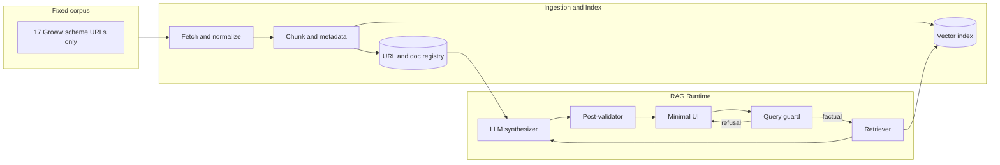

# Phase-Wise Architecture: Mutual Fund FAQ Assistant (Facts-Only RAG)

This document describes a phased architecture for a **lightweight, facts-only** Retrieval-Augmented Generation (RAG) assistant for mutual fund schemes. It aligns with the problem statement on behaviour (facts-only, no investment advice, concise answers with a single citation, refusals, minimal UI, privacy). **For this project, the ingested corpus and any outbound link shown to users are restricted to the fixed URL list in §3.1—no other URLs are crawled, indexed, or cited.**

---

## 1. Guiding Principles

| Principle | Architectural implication |
|------------|---------------------------|
| Accuracy over “clever” generation | Retrieval quality and citation fidelity matter more than model fluency |
| Single source of truth per answer | One primary chunk + one URL per response |
| Compliance by design | Classifier + prompt + post-checks enforce facts-only behavior |
| Minimal data footprint | No PII collection; ephemeral or anonymized telemetry only |

---

## 2. Target End-State (Conceptual)



---

## 3. Phase 0 — Scope, Corpus, and Governance

**Goals:** Lock AMC, schemes, URL list, and compliance rules before engineering heavy work.

**Closed corpus (normative for this repo):** Ingestion, the vector index, retrieval, and user-visible links in factual answers **must** use **only** the seventeen HTTPS URLs in §3.1—same paths, same host. Do not add AMC PDFs, AMFI/SEBI pages, blogs, or other Groww paths unless the manifest in this document is formally revised.

| Workstream | Details |
|------------|---------|
| **AMC selection** | **HDFC Mutual Fund** — single AMC; all schemes are HDFC direct-growth products as represented on the listed Groww pages. |
| **Schemes (this project)** | **Exactly 17 schemes** (one URL each), with category spread across index, caps, ELSS, liquid/short debt, hybrid, thematic/sectoral, and commodity FoFs. Map each to stable internal labels; optional ISIN only as a non-PII identifier. |
| **URL corpus (this project)** | **Only** the seventeen URLs in §3.1. No parallel corpus, no “temporary” extra URLs, no web search at ingest time. |
| **Allowlist** | **Exact URL allowlist:** only the full URLs in §3.1 (not merely `groww.in`). Post-validators and fetchers reject any URL not character-for-character in the manifest. Per-row `source_type`: e.g. `groww_scheme_page`. |
| **Content policy doc** | Allowed question types, forbidden outputs (advice, comparisons, return math), performance-query rule: no return numbers; at most a pointer plus **one link from §3.1** (typically the scheme page being discussed). |
| **“Last updated” policy** | Define whether footer date is crawl time, HTTP `Last-Modified`, or manual refresh date — must be consistent across answers. |

### 3.1 Project URL manifest (Groww scheme pages — complete and final for current phase)

Base host: `https://groww.in`. The **`url_manifest` is exactly this table** (17 rows). These are the **only** permitted source URLs for fetch, index, retrieval context, and citation in this project.

| # | Scheme (short name) | URL |
|---|---------------------|-----|
| 1 | HDFC Mid Cap Fund Direct Growth | https://groww.in/mutual-funds/hdfc-mid-cap-fund-direct-growth |
| 2 | HDFC Silver ETF FoF Direct Growth | https://groww.in/mutual-funds/hdfc-silver-etf-fof-direct-growth |
| 3 | HDFC Equity Fund Direct Growth | https://groww.in/mutual-funds/hdfc-equity-fund-direct-growth |
| 4 | HDFC Small Cap Fund Direct Growth | https://groww.in/mutual-funds/hdfc-small-cap-fund-direct-growth |
| 5 | HDFC NIFTY 50 Index Fund Direct Growth | https://groww.in/mutual-funds/hdfc-nifty-50-index-fund-direct-growth |
| 6 | HDFC Gold ETF Fund of Fund Direct Plan Growth | https://groww.in/mutual-funds/hdfc-gold-etf-fund-of-fund-direct-plan-growth |
| 7 | HDFC Defence Fund Direct Growth | https://groww.in/mutual-funds/hdfc-defence-fund-direct-growth |
| 8 | HDFC Balanced Advantage Fund Direct Growth | https://groww.in/mutual-funds/hdfc-balanced-advantage-fund-direct-growth |
| 9 | HDFC Multi Cap Fund Direct Growth | https://groww.in/mutual-funds/hdfc-multi-cap-fund-direct-growth |
| 10 | HDFC Short Term Opportunities Fund Direct Growth | https://groww.in/mutual-funds/hdfc-short-term-opportunities-fund-direct-growth |
| 11 | HDFC Focused Fund Direct Growth | https://groww.in/mutual-funds/hdfc-focused-fund-direct-growth |
| 12 | HDFC Pharma And Healthcare Fund Direct Growth | https://groww.in/mutual-funds/hdfc-pharma-and-healthcare-fund-direct-growth |
| 13 | HDFC BSE Sensex Index Fund Direct Growth | https://groww.in/mutual-funds/hdfc-bse-sensex-index-fund-direct-growth |
| 14 | HDFC Large Cap Fund Direct Growth | https://groww.in/mutual-funds/hdfc-large-cap-fund-direct-growth |
| 15 | HDFC Large And Mid Cap Fund Direct Growth | https://groww.in/mutual-funds/hdfc-large-and-mid-cap-fund-direct-growth |
| 16 | HDFC Liquid Fund Direct Growth | https://groww.in/mutual-funds/hdfc-liquid-fund-direct-growth |
| 17 | HDFC ELSS Tax Saver Fund Direct Plan Growth | https://groww.in/mutual-funds/hdfc-elss-tax-saver-fund-direct-plan-growth |

**Deliverables:** `url_manifest` (JSON/YAML) that **enumerates exactly** the 17 URLs above (no extras), scheme metadata table (slug, display name, coarse category), signed-off compliance checklist.

**Exit criteria:** Fetcher and index contain chunks **only** from these URLs; validators reject citations not in this list; manifest changes are versioned and intentional (no silent URL creep).

---

## 4. Phase 1 — Ingestion, Normalization, and Indexing

**Goals:** Turn allowlisted URLs into a searchable, attributable knowledge base.

**Implementation order:** Complete **§4.3 subphases in sequence** (1.1 → 1.6). Each subphase should be shippable and verifiable on its own before starting the next; later subphases may assume artifacts from earlier ones (for example raw HTML cache before parse).

### 4.1 Components

| Component | Responsibility |
|-----------|----------------|
| **Fetcher** | HTTP GET with retries, robots.txt respect where applicable, user-agent identification; store raw HTML/PDF bytes and response headers |
| **Parser** | HTML → text; PDF → text (layout-aware if possible); preserve headings for chunk boundaries |
| **Normalizer** | Unicode cleanup, boilerplate stripping (nav/footer), deduplication of repeated disclaimers |
| **Chunker** | Semantic or heading-aware chunks (e.g., 400–800 tokens with overlap); each chunk carries `url`, `title`, `section_path`, `scheme_ids[]`, `doc_type` |
| **Embedder** | Embedding model (local or API) — document choice for cost vs. privacy |
| **Vector store** | In-process (e.g., Chroma/FAISS) or managed — acceptable for “lightweight” MVP |
| **Metadata store** | SQLite/JSON for URL → last_fetch, etag, content hash, `source_last_updated` for footer |

### 4.2 Data flow

1. Scheduled or on-demand job reads URL manifest.
2. Conditional GET (ETag/If-Modified-Since) reduces churn.
3. Parsed text → chunks → embeddings → upsert into vector index.
4. Failed fetches logged; stale content flagged in admin/runbook (not shown to end users as “truth”).

### 4.3 Subphases (implement one at a time)

| ID | Subphase | Scope | Exit check (minimum) |
|----|----------|-------|----------------------|
| **1.1** | **Manifest → fetch** | Load and validate `corpus/url_manifest.yaml`; HTTP GET **only** `groww_scheme_url` values; retries, timeouts, identifiable user-agent; persist raw response bytes and response headers (ETag, `Last-Modified` if present) per URL; log failures per URL without discarding prior good cache if using overwrite-on-success. | All 17 URLs fetch successfully in a dry run **or** failures are explicitly reported; no request targets a URL outside the manifest. |
| **1.2** | **Parse → clean text** | Read cached raw HTML per URL; extract main text (DOM-aware); normalize Unicode; strip nav/footer boilerplate; optional dedupe of repeated blocks; write normalized text artifact per URL with a stable schema. | Each successful fetch from 1.1 yields non-empty normalized text above an agreed size floor **or** is flagged for manual review. |
| **1.3** | **Chunk + metadata** | Split normalized text into chunks (heading-aware or fixed window with overlap); attach `chunk_id`, `source_url` (exact §3.1 string), `scheme_id`, `section_path` or heading trail, `doc_type`; validate that no chunk lacks `source_url`. | Chunk records exist for the full corpus; counts and average chunk length within agreed bounds; spot-check one scheme for boundary sanity. |
| **1.4** | **Embed** | Embed the **Phase 1.3 artifacts** (`data/chunks/<scheme_id>/chunks.jsonl`). For each chunk line, embed the `text` field (which currently includes both `mfServerSideData`-flattened text and visible-page text, with `section_path` derived from `<<<SECTION:…>>>`). Persist an embeddings dataset keyed by **`chunk_id`** (and carrying `scheme_id`, `source_url`, `doc_type`, `section_path`, `char_count`) plus embedding metadata (`embedding_model`, `embedding_dim`, `embedded_at_utc`). Use batching + backoff for transient failures; never emit embeddings for non-manifest URLs. | For every chunk in every `chunks.jsonl`, there is exactly one embedding record with matching `chunk_id`; embedding dimension is consistent; reruns are idempotent (stable `chunk_id` join) and failed batches can be retried without duplicating records. |
| **1.5** | **Vector index build** | Create or update the vector store (for example FAISS or Chroma); **replace-by-URL** or full rebuild so stale chunks cannot linger; persist index artifacts under a versioned path. | Smoke retrieval (nearest neighbors) for a held-out query works; all retrieved chunk metadata shows `source_url` ∈ §3.1. |
| **1.6** | **Metadata registry + orchestration** | Persist URL-level metadata (`last_fetch`, content hash, optional ETag); record `ingestion_batch_id` or UTC batch date for alignment with `docs/last-updated-policy.md`; single CLI or job that runs 1.1→1.5 in order with structured logging and non-zero exit on failure (policy for partial success documented). | Full pipeline from manifest + dependencies reproduces the index; metadata records the batch date; **Phase 1 overall exit criteria** below are met. |

**Exit criteria (Phase 1 overall, after subphase 1.6):** Every indexed chunk traces to **one of the seventeen URLs in §3.1**; re-ingestion is repeatable from that manifest alone.

---

## 5. Phase 2 — Retrieval and Grounded Generation

**Goals:** Answer factual MF questions using retrieved text only; enforce length and single citation.

### 5.1 Retrieval

| Aspect | Recommendation |
|--------|----------------|
| **Strategy (best for current data)** | **Lexical-first retrieval** (keyword/BM25-like scoring) over `chunk.text`, then **optional vector rerank** when a semantic embedding model is added. This matches the current corpus shape: flattened key/value fields (`mfServerSideData`) + visible page text, where exact terms (`exit_load`, `expense_ratio`, `benchmark`, `fund_manager`, `aum`, `tax_impact`, etc.) are common. |
| **Query rewrite** | Rule-based synonym/normalization map (no web search): e.g. `ter → expense ratio`, `expense → expense_ratio`, `nav → nav`, `exit load → exit_load`, `aum → aum`, `benchmark → benchmark_name`. |
| **Filters** | Pre-filter by `scheme_id` when user intent implies a scheme (explicit scheme name/slug); otherwise allow all schemes. Always enforce `source_url` ∈ §3.1. |
| **Section-aware boosting** | Boost chunks whose `section_path` matches the query intent (`exit_load`, `expense_ratio`, `benchmark`, `fund_manager_details`, etc.). |
| **Top-k** | Keep k small (3–5) to reduce contradictions. Prefer multiple chunks from the **same scheme** when the question is scheme-specific. |
| **Hybrid (later)** | After switching to a semantic embedder: BM25/lexical top-20 → vector rerank top-5 → final top-3. |

### 5.2 Generation (LLM)

- **LLM provider**: Use **Groq** for LLM calls (Phase 2+). Store credentials as environment variables / GitHub Action secrets (e.g. `GROQ_API_KEY`); never commit secrets.
- **System policy:** Facts only; max **3 sentences**; **exactly one** markdown or plain URL from the provided context; include footer: `Last updated from sources: <date>`.
- **Context packaging:** Inject retrieved chunks with explicit `[source_url]` lines so the model cannot invent links.
- **Temperature:** Low (e.g., 0–0.3) for determinism.

### 5.3 Citation enforcement

| Layer | Purpose |
|-------|---------|
| **Prompt** | Require citation from context only |
| **Post-validation** | Regex/check that exactly one URL appears and it is **identical** to one of the §3.1 URLs (typically the page used in retrieval) |
| **Fallback** | If validation fails → safe message + **at most one** link chosen from §3.1 (e.g. the relevant scheme page); no URLs outside the manifest |

**Exit criteria:** Sample eval set: ≥ agreed threshold of answers with correct fact, valid single URL, and ≤3 sentences.

---

## 6. Phase 3 — Guardrails, Refusal, and Edge Cases

**Goals:** Refuse advisory or comparative questions politely; handle performance and ambiguity safely.

### 6.1 Query gate (recommended stack)

1. **Classifier** (rules + small model or LLM with structured output): labels such as `FACTUAL_MF`, `ADVISORY`, `COMPARISON`, `PERFORMANCE_HISTORY`, `OUT_OF_SCOPE`, `AMBIGUOUS`.
2. **Behavior:**
   - `ADVISORY` / `COMPARISON` → refusal template; if a link is included, it **must** be one URL from §3.1 (e.g. a scheme page that carries generic disclosures text)—never a URL outside the manifest.
   - `PERFORMANCE_HISTORY` → no return numbers; short pointer + **one URL from §3.1** only (e.g. that scheme’s Groww page).
   - `AMBIGUOUS` → clarify which scheme (from the seventeen) **without collecting PII**; if clarification is needed, **do not include any URL**.
   - `UNKNOWN` (no grounded snippet found) → respond with “not found in the indexed corpus” and **do not include any URL**.
   - `PERSONAL_INFO` (PAN, Aadhaar, account numbers, OTP, phone/email, portfolio/transaction details, KYC) → refuse and **do not include any URL**.

### 6.2 Refusal content template (non-binding example structure)

- Acknowledge limitation (facts-only, no advice).
- Suggest rephrasing toward verifiable facts.
- Optional: **at most one** link, and **only** from §3.1 if a link is shown.

### 6.3 Safety

- No training or logging of PAN, Aadhaar, account numbers, OTPs, email, phone.
- If chat persistence exists: session-only or random session ID; no identity fields.
- **No-URL rule for sensitive/unknown**: If the query is `PERSONAL_INFO` **or** the system cannot answer from retrieved chunks (`UNKNOWN`), the assistant must return **no URL** (to avoid encouraging sharing personal details or giving a false sense of authority).

**Exit criteria:** Red-team list of advisory prompts consistently refused; no comparative “better/worse” language in outputs.

---

## 7. Phase 4 — Minimal User Interface

**Goals:** Welcome, examples, disclaimer, chat surface — no scope creep.

| Element | Requirement |
|---------|-------------|
| **Welcome** | Facts-only positioning |
| **Example questions** | Three prompts aligned with scope (expense ratio, exit load, ELSS lock-in, etc.) |
| **Disclaimer** | Visible: “Facts-only. No investment advice.” |
| **Message rendering** | Show assistant answer, single clickable source, footer date |
| **Privacy** | No login; no PII forms |

**Stack options (illustrative):** Static SPA + API, or server-rendered page + same API — keep deployment simple.

**Exit criteria:** UI review against problem statement checklist; disclaimer always visible on first screen.

---

## 8. Phase 5 — Evaluation, Monitoring, and Limitations

**Goals:** Prove success criteria and document known gaps.

| Activity | Detail |
|----------|--------|
| **Golden set** | Curated Q&A with expected fact, **expected URL ∈ §3.1**, and date semantics |
| **Retrieval metrics** | Hit rate @k, wrong-scheme rate |
| **Generation metrics** | Citation validity, sentence count, refusal accuracy |
| **Regression** | Re-run after corpus refresh |
| **Limitations doc** | Stale Groww HTML, tables parsed poorly, multi-scheme name collisions, language (English-only), corpus locked to §3.1, etc. |

**Exit criteria:** README-level architecture overview and limitations accurate; stakeholders agree on “known failures” messaging.

---

## 9. Phase 6 — Deployment and Operations (Lightweight)

**Goals:** Repeatable builds, controlled refreshes, no sensitive data at rest.

| Concern | Approach |
|---------|----------|
| **Environments** | Dev / prod minimal split |
| **Secrets** | API keys in env vars; never in repo |
| **Corpus refresh** | **GitHub Actions scheduled workflow** (recommended) or manual run; always run the Phase 1.6 pipeline; version the manifest hash with the index |
| **Backup** | Vector index + manifest reproducible from sources (optional full raw cache) |
| **Observability** | Aggregate latency, error rate, refusal rate — no message content if policy requires |

**Exit criteria:** Fresh clone + documented steps yield running system; re-index documented.

### 9.1 Scheduled refresh via GitHub Actions (recommended)

Use a scheduled GitHub Actions workflow to rebuild the Phase 1 index so the assistant always answers from a recent snapshot.

- **Trigger**: `schedule` (cron) + `workflow_dispatch` (manual).
- **Job**: run `python -m ingestion.phase1.subphase_1_6_orchestrate` (the orchestrator for 1.1→1.5 + registry).
- **Closed corpus enforcement**:
  - Manifest is validated (`scripts/validate_manifest.py`) before ingestion steps.
  - Fetcher must only request the exact `groww_scheme_url` strings from §3.1 / `corpus/url_manifest.yaml`.
  - Index build must refuse any record whose `source_url` is not in the allowlist.
- **Batch date for compliance footer**: the workflow run writes `ingestion_batch_date_utc` (UTC `YYYY-MM-DD`) into the registry and index metadata per `docs/last-updated-policy.md`.
- **Persistence strategy (pick one; do not mix)**:
  - **Artifact-only**: Upload `data/index/<index_name>/` and `data/registry/` as build artifacts; download them in deployment.
  - **Commit-to-repo (simple, but noisier)**: Commit the refreshed index+registry to a dedicated branch (e.g. `index-snapshots`) and deploy from that branch. Never commit raw HTML caches unless explicitly required.
  - **External storage (recommended for prod)**: Upload index+registry to object storage; production reads from latest pointer.
- **Failure policy**: On any subphase failure (fetch/parse/chunk/embed/index), the workflow exits non-zero and does **not** publish partial outputs; last known-good index remains active.

---

## 10. Repository / Module Layout (Suggested)

```
├── README.md
├── requirements.txt
├── docs/
│   ├── problemstatement.md
│   ├── phase-wise-architecture.md
│   ├── content-policy.md
│   ├── compliance-checklist.md
│   ├── last-updated-policy.md
│   ├── edge-cases-phase-0.md
│   ├── edge-cases-phase-1.md
│   ├── edge-cases-phase-2.md
│   ├── edge-cases-phase-3.md
│   ├── edge-cases-phase-4.md
│   ├── edge-cases-phase-5.md
│   └── edge-cases-phase-6.md
├── corpus/
│   ├── README.md
│   └── url_manifest.yaml
├── scripts/
│   └── validate_manifest.py
├── ingestion/
│   ├── README.md
│   ├── fetch.py              # shim → phase1.subphase_1_1_fetch
│   ├── parse_chunk.py        # shim → phase1.subphase_1_2_parse
│   ├── index_build.py        # shim → phase1.subphase_1_5_index
│   ├── chunk.py              # shim → phase1.subphase_1_3_chunk
│   └── phase1/
│       ├── README.md
│       ├── common/           # manifest, paths
│       ├── subphase_1_1_fetch/   # runner.py, __main__.py
│       ├── subphase_1_2_parse/   # next_data_extract, flatten, html_clean, runner
│       ├── subphase_1_3_chunk/   # chunker, runner
│       ├── subphase_1_4_embed/
│       ├── subphase_1_5_index/
│       └── subphase_1_6_orchestrate/
├── app/
│   ├── README.md
│   ├── api/
│   ├── rag/
│   ├── guardrails/
│   └── ui/
├── tests/
│   ├── golden/
│   └── test_refusals.py
└── deploy/
    └── README.md
```

*(Actual layout may vary; this illustrates separation of concerns.)*

---

## 11. Risk Register (Architecture-Relevant)

| Risk | Mitigation |
|------|------------|
| Hallucinated URLs | Post-validate against §3.1; fallback to a safe message + one §3.1 URL |
| Stale regulatory text | Versioned ingestion + visible “last updated” |
| User jailbreaks | Layered guardrails; default to refusal + education link |
| PDF table errors | N/A if corpus is HTML-only from §3.1; if a page embeds PDFs, parse with care and spot-check numeric fields |

---

## 12. Mapping to Success Criteria

| Success criterion | Phase primarily responsible |
|-------------------|----------------------------|
| Accurate factual retrieval | 1, 2, 5 |
| Strict facts-only | 2, 3, 5 |
| Valid single citation | 2, 5 |
| Proper refusals | 3, 5 |
| Clean minimal UI | 4 |

---

## 13. Summary

Delivery is intentionally **staged**: first **corpus and governance** (Phase 0), then **trustworthy indexing** (Phase 1, **subphases 1.1–1.6 in §4.3**), then **grounded answers with citation enforcement** (Phase 2), **compliance guardrails** (Phase 3), **minimal UI** (Phase 4), **evaluation** (Phase 5), and **lightweight ops** (Phase 6). This ordering reduces rework and keeps the system aligned with the core product promise: **verified, source-backed mutual fund facts with no advisory bias.**

**Per-phase edge cases:** See `edge-cases-phase-0.md` through `edge-cases-phase-6.md` in the same `docs/` folder—each file maps to the phase sections above and expands failure modes and handling notes.
